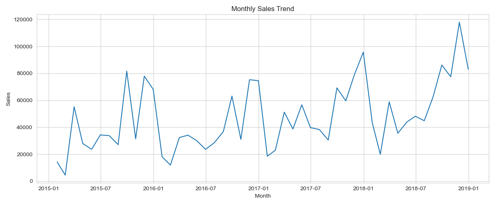
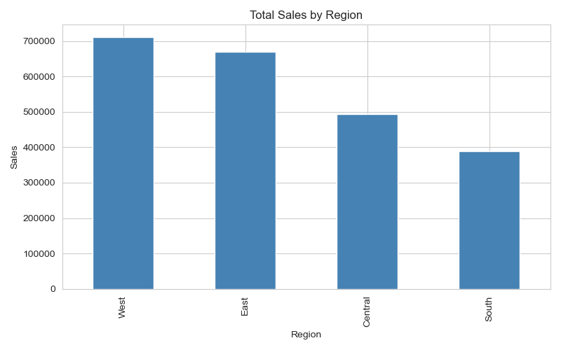
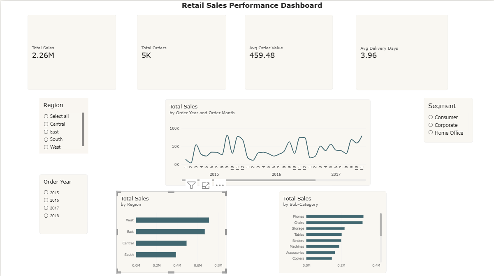
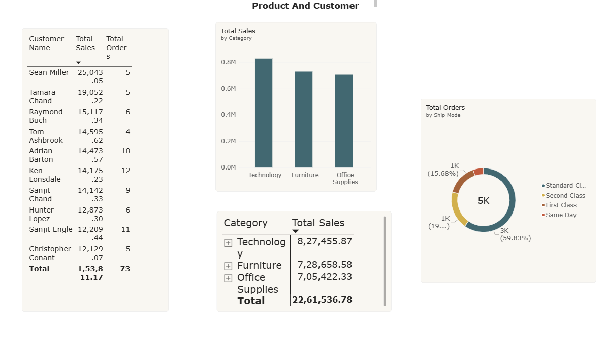

 📊 Retail Sales Performance Dashboard
An end-to-end data analytics project covering data cleaning, SQL analysis, and an interactive Power BI dashboard — built on 4 years (2015–2018) of retail order data (~9,800 orders).

📑 Table of Contents
- [Problem Statement](#-problem-statement)
- [Tools Used](#-tools-used)
- [Approach](#-approach)
- [Key Insights](#-key-insights)
- [Python EDA Charts](#-python-eda-charts)
- [Power BI Dashboard Preview](#-power-bi-dashboard-preview)
- [Repository Structure](#-repository-structure)
- [How to Run This Project](#-how-to-run-this-project)

 🎯 Problem Statement
Retail businesses generate large volumes of order-level data but often lack a consolidated view of sales trends, regional performance, and customer/product insights. This project builds a complete analytics pipeline — from raw data to an interactive dashboard — to help stakeholders quickly identify growth trends, top-performing regions/products, and customer value.

 🛠️ Tools Used
| Tool | Purpose |
|------|---------|
| Python (Pandas, Matplotlib, Seaborn) | Data cleaning, feature engineering, exploratory analysis |
| SQL (MySQL) | Business-question queries using joins, CTEs, and window functions |
| Power BI | Interactive 2-page dashboard with DAX measures and slicers |

 🔍 Approach

<b>1. Data Cleaning (Python)</b> — click to expand

 

- Handled missing values and removed duplicates
- Parsed and standardized date columns
- Engineered features: Order Year, Order Month, Order Month Name, Delivery Time (Days)
- Exported cleaned dataset for SQL and Power BI use

<b>2. SQL Analysis</b> — click to expand

 

12 queries answering real business questions:
- Monthly sales trend
- Year-over-Year growth by region (`LAG` window function)
- Top 10 products and customers (`RANK` window function)
- Category → Sub-Category rollups
- Delivery time by region and ship mode
- Running total of sales (`SUM() OVER`)

<b>3. Power BI Dashboard</b> — click to expand

 

Overview Page
- KPI cards: Total Sales, Total Orders, Avg Order Value, Avg Delivery Days
- Monthly sales trend line (2015–2018)
- Sales by Region and Sub-Category bar charts
- Interactive Region / Segment / Order Year slicers

Product & Customer Page
- Top 10 customers table
- Sales by Category chart
- Ship Mode breakdown (donut chart)
- Category → Sub-Category drill-down matrix

💡 Key Insights

 🏆 West region leads in total sales, followed by East, Central, and South — a ~40% gap between top and bottom region

 📱Phones and Chairs are the top two sub-categories by revenue, notably ahead of the rest of the product range

 📈 Sales show a clear seasonal pattern with recurring mid-year dips and a strong ramp-up toward Q4 (Nov/Dec) each year, alongside an overall upward trend from 2015 to 2018

 💻 Technology is the top-performing category overall, ahead of Furniture and Office Supplies

 🚚 Standard Class shipping accounts for ~60% of all orders, with Same Day making up the smallest share

 ⏱️ Average delivery time sits at just under 4 days across all orders, with some regional/ship-mode variation worth further investigation

📈 Python EDA Charts

Charts generated during the initial exploratory analysis (see `/notebook/retail_sales_analysis.py`):

Monthly Sales Trend

Sales by Region

🖼️ Power BI Dashboard Preview

 Overview Page
  

 Product & Customer Page
 

 📁 Repository Structure

├── data/                  → raw and cleaned CSV files

├── notebook/              → Python cleaning + EDA script + chart outputs

├── sql/                   → SQL queries (setup + 12 analysis queries)

├── dashboard/             → Power BI .pbix file + page screenshots

└── README.md              → this file

